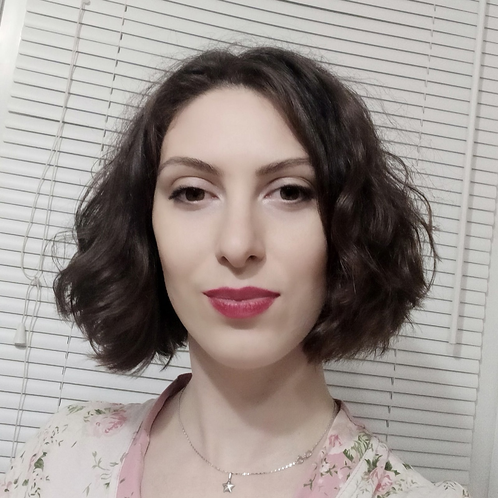

> **АНЖЕЛИКА ПОЛЯКОВА**

В прошлом инженер, в настоящем расстановщик и астролог, решила в 30 лет стать программистом!
Soft skills вполне приличный, а вот с hard пока сложнее. Надеюсь и верю, что Нетология даст достаточное количество знаний, которые я смогу впитать и со слезами счастья на глазах устроиться джуном ну или стажером, войти в IT и не выйти сразу же!

Мои текущие способности
- Основы Java
- ООП
- Git
- Основы SQL

